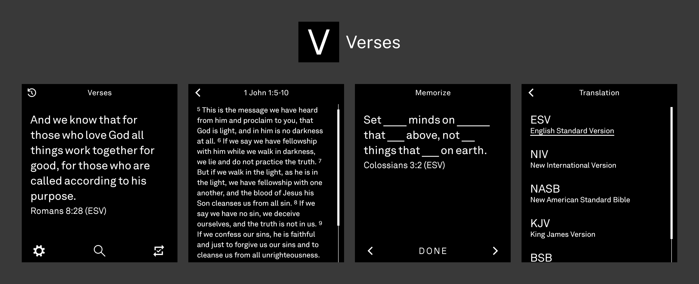

# Verses

A daily Bible verse tool for the Light Phone III, built with the official [Light SDK](https://github.com/lightphone/light-sdk).

Shows one verse a day, refreshed automatically each morning. Look up the verse for any past date, jot a note against any verse, and spend focused time memorizing God's word.

---



## Features

* One Bible verse a day, cycling through a bundled reference list by day-of-year
* Look up the verse for any past date
* Add free-text notes to any verse, and edit them anytime
* All your notes in one place, most recent first
* Memorize mode: hide a few random words at a time, with forward/back buttons to gradually hide/reveal the text

---

## Translations
*If you have a specific version you'd like to see in Verses, [open an issue](https://github.com/zacksimpson/verses-tool/issues?q=state%3Aopen%20label%3ATranslations) with the request and I will gladly look into it!*

**Currently Supported:**
* English Standard Version (ESV)
* New International Version (NIV)
* New American Standard Bible (NASB)
* (More to come!)

---

## Installing on Light Phone III
> [!WARNING]
> **This project is in early development and is not ready for production.** Expect rough edges and missing features. That said, feel free to download, use it, and give feedback on its direction!
* Highly recommend using [Obtainium](https://github.com/ImranR98/Obtainium) to ensure you receive future updates and new features automatically. Just add [the repo URL](https://github.com/zacksimpson/verses-tool/), make sure you're able to install apps from unknown sources, and you're all set.
* Alternatively, you can download the latest APK from the Releases tab.
* Once the official Light SDK matures and LightOS enables support for installing APKs from the Dashboard, installing there will eventually be an option as well – but not for now.
<details>
<summary><strong>Building from Source</strong></summary>

**ESV**

1. Get a free ESV API key at https://api.esv.org (sign up, create an API application).
2. Add it to this repo's root `local.properties` (gitignored, create the file if it
   doesn't exist):

   ```
   esvApiKey=your_key_here
   ```

**YouVersion Platform (NIV, NASB)**

1. Request an app key at https://developers.youversion.com (sign up, create an app).
2. Add it to the same `local.properties` file:

   ```
   youVersionAppKey=your_key_here
   ```

**Build**

Open in Android Studio, or build from the command line:

```
./gradlew :verses:assembleDebug
```

Without a key, the tool shows a message asking you to add one instead of making a
network call. Run on the [LightOS emulator](docs/system_app) for full compatibility,
or any Android emulator/device for everyday development – see `docs/` (inherited from
light-sdk) for details.

</details>

---

## Support

If any of my tools have been useful to you, I'd love to hear from you! Feel free to [email me](mailto:zacksimpson24@gmail.com), or [open an issue](https://github.com/zacksimpson/verses-tool/issues/) with your feedback.

---

## Credits

* [The Light Phone](https://www.thelightphone.com) – for building a phone worth making tools for
* [Crossway](https://www.crossway.org) – for the ESV® Bible text, made available via the [ESV API](https://api.esv.org)
* [YouVersion Platform](https://platform.youversion.com) – for the NIV® and NASB® Bible translations, made available via the [YouVersion API](https://developers.youversion.com/api/data-exchange)
