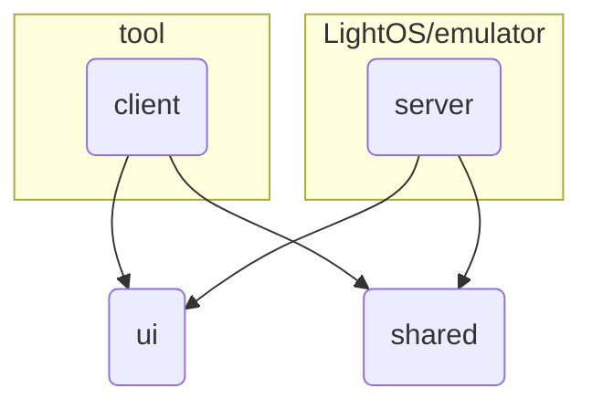

# Light SDK Repo
This repository contains a number of interdependent Gradle modules that make up the Light SDK. Here are their high level descriptions + a chart showing their relationships:

### [`:tool`](../../tool)
This is the scaffold dev environment in which you should write your custom Light Phone tool, assuming that's what you're here to do! This module compiles into an Android APK which can be installed onto a Light Phone or Android emulator. Start by modifying [`HomeScreen.kt`](../../tool/src/main/kotlin/com/thelightphone/sample/HomeScreen.kt
).

### [`:plugin`](../../plugin)
Contains the source for a Gradle build plugin that polices which third-party dependencies can be pulled into any module that applies it. In an effort to keep Light Phone tools simple and safe, we are blocking most third-party libraries and plugins by default. The lists of allowed dependencies can be found in [`LightSdkPlugin.kt`](../../plugin/src/main/kotlin/com/thelightphone/plugin/LightSdkPlugin.kt). We are happy to add more to the allow-lists over time! If you've got an open-source or otherwise verifiable library that you think we should include, please make a PR. You are also free to modify these lists as you develop locally, but keep in mind that if you are expecting Light to sign/promote your tool, we will be compiling your `tool` source against the official `plugin` release found here.

### [`:lint-rules`](../../lint-rules)
Works alongside `plugin` to block the usage of Android/third-party APIs that we're not ready to officially support.

### [`:sdk:ui`](../../sdk/ui)
Collection of Light-designed UI/UX elements (styles, themes, icons, primitives, etc) that can and should be used to build your tool. You do not have to use these exclusively, but we hope it makes it easier to build tools that fit seamlessly on a Light Phone. Everything is written for [Compose](https://kotlinlang.org/compose-multiplatform/)

### [`:sdk:client`](../../sdk/client)
An Android library that gets compiled into every Light tool to allow it to communicate with LightOS (more specifically, the `server` library embedded _within_ LightOS)

### [`:sdk:server`](../../sdk/server)
An Android library that gets compiled into LightOS (as well as the `emulator` app) that allows it to communicate with tools developed using the sdk.

### [`:sdk:shared`](../../sdk/shared)
A Java library that contains constants and data models shared between `client` and `server`.

### [`:sdk:emulator`](../../sdk/emulator)
An Android application meant to serve as a very simple LightOS emulator. It should be [run as a system app](../system_app) on an Android emulator. It does not do all the things LightOS does! It is really just meant to be a wrapper for the `server` library so you can test how your `tool` will feel on real Light hardware.

### [`:examples:[x]`](../../examples)
The examples directory contains a few different tools that were built using the SDK libraries.

### [`builder`](../../builder)
(Not a Gradle module) This is the containerized build harness Light will run on our own servers to compile community tools. When you queue up a release to be signed and shared (see [Sharing Your Tool](../../README.md#sharing-your-tool)), we clone your public git commit into this image and build your `tool` module against a pinned copy of the SDK (offline and sandboxed) and we archive the extracted source alongside the APK. This is the first step toward fully reproducible builds, where anyone can rebuild a shared tool from source and verify it byte-for-byte against what we signed. See [`builder/README.md`](../../builder/README.md) for how to run it locally.

